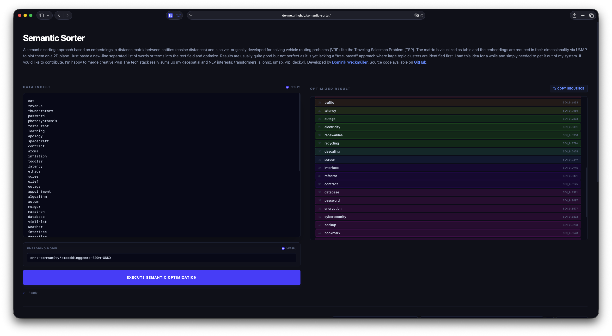
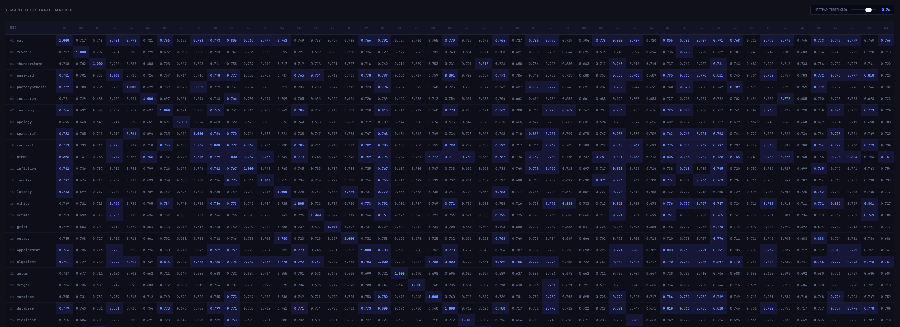
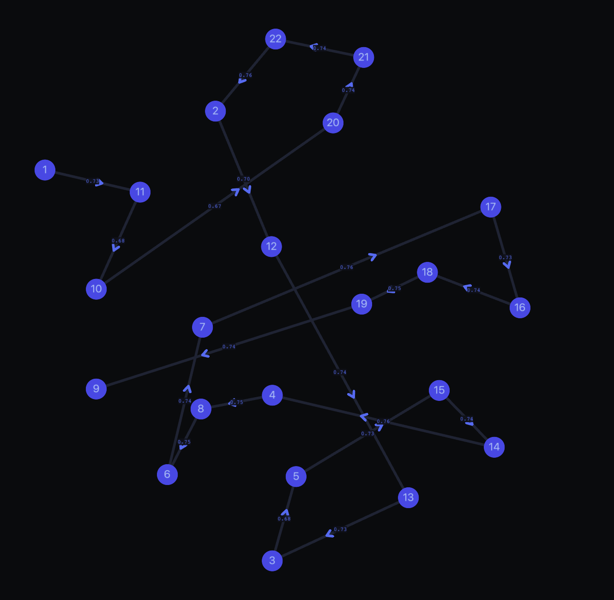
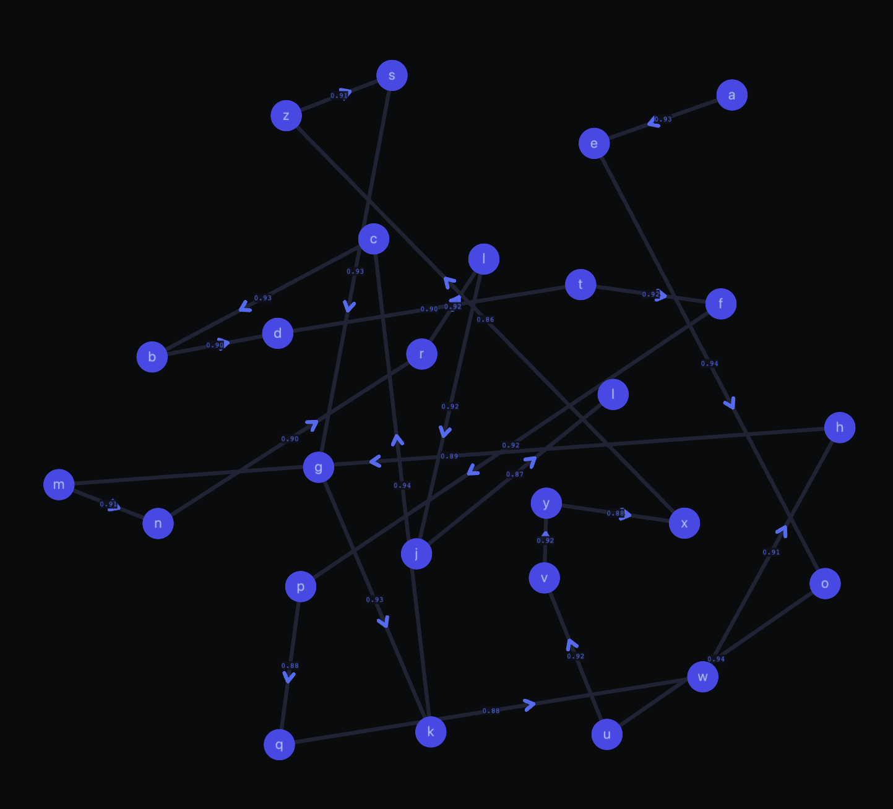

# Semantic Sorter
**High-Performance Sequence Optimization via Manifold Learning**

## Overview
Semantic Sorter is a technical tool designed to reorder unstructured text datasets into semantically coherent sequences. By leveraging high-dimensional transformer embeddings and topological optimization, it converts an unordered list into a "train of thought" where transitions between items represent the shortest semantic distance.

Unlike alphabetical sorting, which relies on lexicographical order, Semantic Sorter analyzes the underlying meaning of each entry. This is achieved by treating the dataset as a Traveling Salesperson Problem (TSP) on a semantic manifold.

## Core Features
- **Deterministic Optimization**: Utilizes mathematical solvers to find globally optimal transitions, ensuring reproducible results without the stochastic nature of large language model (LLM) generation.
- **Client-Side Processing**: All computations, including transformer inference and route optimization, are executed locally in the browser. No data is transmitted to external servers, ensuring complete privacy.
- **High-Dimensional Integrity**: Optimization is performed on high-dimensional embedding vectors (e.g., 768 for the default model). Dimensionality reduction (UMAP) is used strictly for visualization, never for the core sorting logic.
- **High-Performance Execution**: Employs WebGPU for transformer inference and WebAssembly (WASM) for heavy mathematical computations, providing a high-performance experience on modern consumer hardware.







## Methodology
The application follows a three-stage pipeline to achieve precise semantic reordering:

1. **Embedding (Vectorization)**: The tool uses an ONNX-optimized transformer model (e.g., `embeddinggemma-300m`) to map each line of text into a high-dimensional vector space. These dense vectors capture the semantic context and relationships between terms.
2. **Optimization (Manifold Traversal)**: A distance matrix is calculated using cosine similarity between all pairs. The system then solves the Traveling Salesperson Problem (TSP) through this high-dimensional space. The result is an ordered sequence that minimizes the total semantic "distance" between consecutive items.
3. **Projection (Visualization)**: To provide visual intuition, Uniform Manifold Approximation and Projection (UMAP) is used to project the high-dimensional clusters onto a 2D plane. This interactive map allows users to explore the semantic landscape of their data.

## Technical Comparison

| Feature | LLM Sorting | Semantic Sorter |
| :--- | :--- | :--- |
| Approach | Top-Down Categorization | Bottom-Up Topological Flow |
| Consistency | Stochastic (Variable output) | Deterministic (technically - even though VRP is yet missing this feature results are usually reproducible) |
| Performance | Network Latent | Local (WebGPU/WASM) |
| Reliability | Potential hallucinations or omissions | Zero data loss; mathematically rigorous (in theory) |

## Technical Stack
Semantic Sorter integrates several research-grade technologies into a cohesive web platform:

- **AI Inference**: `@huggingface/transformers` running ONNX-optimized models.
- **Manifold Learning**: `umap-js` for dimensionality reduction.
- **Route Optimization**: Custom WebAssembly (WASM) implementation of a [Vehicle Routing Problem (VRP)](https://github.com/reinterpretcat/vrp) solver.
- **Visualization**: `deck.gl` and `maplibre-gl` for high-performance WebGL rendering (could also use WebGPU but not needed here)
- **Development Framework**: Vite, TypeScript, and Tailwind CSS.

## Getting Started

### Browser Requirements
- A modern browser with WebGPU support is recommended for optimal inference speed. On small datasets with <20 entities the difference is negligible.
- WebAssembly (WASM) support is required for the optimization solver.

### Local Installation
To run the project locally for development or private use:

```bash
# Clone the repository
git clone https://github.com/do-me/semantic-sorter.git

# Enter the project directory
cd semantic-sorter

# Install dependencies
npm install

# Start the development server
npm run dev
```

## Usage
1. **Data Entry**: Paste a newline-separated list of terms or sentences into the input panel.
2. **Model Initialization**: Load the embedding model. The model is downloaded once and cached locally in the browser.
3. **Execution**: Run the semantic optimization. The process includes embedding generation, distance matrix computation, and TSP solving.
4. **Analysis**:
   - **Sorted Sequence**: View the resulting list. Hue-based color coding represents semantic topic clusters.
   - **Semantic Map**: Explore the interactive 2D projection to understand how the algorithm clusters related concepts.
   - **Distance Matrix**: (Optional) Toggle the matrix view to inspect raw similarity scores.

# Recommended models

- `onnx-community/embeddinggemma-300m-ONNX`
- `onnx-community/Qwen3-Embedding-0.6B-ONNX`

## To Do
- multi-threading for VRP in wasm for faster results 
- benchmarks
- add heuristics for pre-clustering for identifying clusters that should not be separated

## Research and Attribution
The optimization logic is based on several key research areas in manifold learning and combinatorial optimization. 
Developed by [Dominik Weckmüller](https://github.com/do-me) relying on amazing open source projects.

## Citation
If you use this tool in your research, please cite it as follows:

```bibtex
@misc{weckmueller2026semanticsorter,
  author = {Weckmüller, Dominik},
  title = {Semantic Sorter: High-Performance Sequence Optimization via Manifold Learning},
  year = {2026},
  publisher = {GitHub},
  journal = {GitHub repository},
  howpublished = {\url{https://github.com/do-me/semantic-sorter}}
}
```

APA: 

> Weckmüller, D. (2026). *Semantic Sorter: High-Performance Sequence Optimization via Manifold Learning*. GitHub. https://github.com/do-me/semantic-sorter

Additionally, please consider cite the foundational VRP solver:

```bibtex
@misc{builuk_rosomaxa_2023,
    author       = {Ilya Builuk},
    title        = {{A new solver for rich Vehicle Routing Problem}},
    year         = {2023},
    doi          = {10.5281/zenodo.4624037},
    publisher    = {Zenodo},
    url          = {https://zenodo.org/records/14063797}
}
```

APA:

> Builuk, I. (2024). Rosomaxa, Vehicle Routing Problem Solver (v1.25.0). Zenodo. https://doi.org/10.5281/zenodo.14063797

